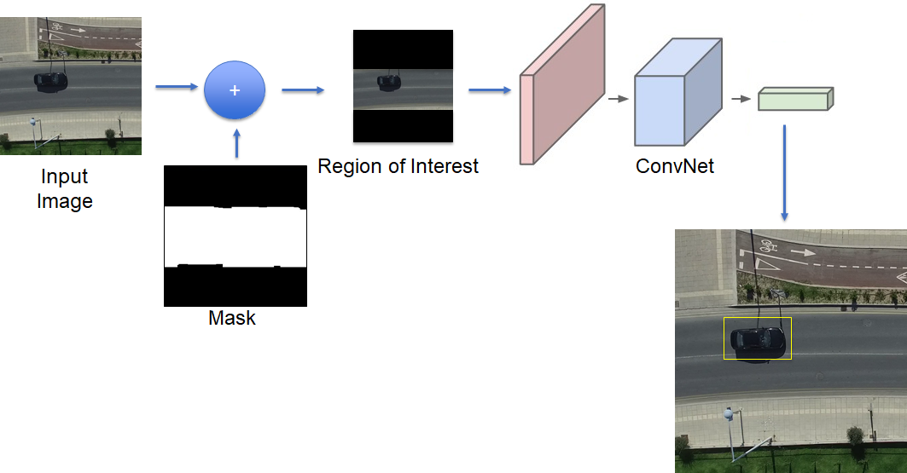
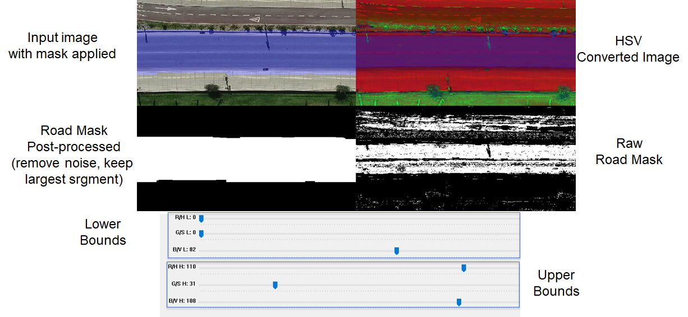
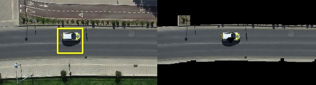

# Training a deep-learning classifier for aerial top view detection of vehicles

## Overview

Deep learning approaches have demonstrated state-of-the-art performance in various computer vision tasks such as object detection and recognition. In this repository I provide code and details on how to develop and train a Convolutional Neural Network (CNN) to detect top-view vehicles from UAV footage.




### Convolutional Neural Network

The Convolutional Neural Network (CNN) used is a conventional one and rather small compared to other models such as VGG16 and ResNet50. The purpose is to have a small example to allow for rapid expiramentation. The CNN accepts as input an image patch of 50x50 pixels (default). The patches are extracted using the [sliding window appoach](https://medium.com/@ckyrkou/have-you-ever-thought-of-detecting-objects-using-machine-learning-tools-4a67a6fe0522). More recent techniques such as **YOLO** and **Faster-RCNN** can be used but this repo can serve as a good starting point for someone looking starting now with objecte detection systems. 


### Color thresholding

To identify potential regions of interest such as the road, which is more probable to containg vehicles color thresholding is performed. But first it is necessary to identify the color regions that represent the area we are looking for. For this reason the *sliders_color.py* implements a GUI which takes as input an image and uses slider bars for the minimum and maximum pixels values per 3 color channesl in order to identigy the range of colors to isolate. The specific chromatic model used is the [HSV model](https://en.wikipedia.org/wiki/HSL_and_HSV). 



## Dataset

The dataset used is a subset of a larger dataset collected using a *DJI Matrice 100 UAV*. The vehicle images where cropped and used to construct a training and validation set.

```
./
└───data
│   │
│   └───train
│       │   └───cars
│   │   │    |    cars (1).jpg
│   │   │    |    cars (2).jpg
.
.
│   │   │    |    cars (503).jpg
│       │   └───non_cars
│   │   │    |    non_cars (1).jpg
│   │   │    |    non_cars (2).jpg
.
.
│   │   │    |    non_cars (2298).jpg
│   └───validation
│       │   └───cars
│   │   │    |    cars (1).jpg
│   │   │    |    cars (2).jpg
.
.
│   │   │    |    cars (2393).jpg
│       │   └───non_cars
│   │   │    |    non_cars (1).jpg
│   │   │    |    non_cars (2).jpg
.
.
│   │   │    |    non_cars (2738).jpg
```

The imades are contained within **data.zip**, just extract to the root folder. You are ncouraged to enrich the dataset in order to obtain more robust results. Please acknowledge the original dataset.

## Dependencies
- Python - 3.6.4
- Keras - 2.2.0
- Tensorflow - 1.5.0
- Numpy - 1.14.5
- OpenCV - 3.4.0

## Run

Use the command **python <filename>.py** to run one of **sliders_color.py**,**train_classifier.py**, or **detection.py**. Any parameters can be changed through the python files. The color thresholding is performed on the provided image. The best values will need to be past through to the detection stage. The detection stage has two modes one using the mask and one with just the sliding window. The window size, stride of the window, and rescale factors can all be modified within the python files. 

An initial model is provided in **weights_best.h5**. This is the file generated while training. You are encouraged to built better models to achieve better results. The model operates on 50x50 images with pixel values scaled between [0-1]. It is a relativally small model for experimentation.

```
_________________________________________________________________
Layer (type)                 Output Shape              Param #
=================================================================
conv2d_1 (Conv2D)            (None, 46, 46, 32)        2432
_________________________________________________________________
activation_1 (Activation)    (None, 46, 46, 32)        0
_________________________________________________________________
max_pooling2d_1 (MaxPooling2 (None, 23, 23, 32)        0
_________________________________________________________________
conv2d_2 (Conv2D)            (None, 19, 19, 32)        25632
_________________________________________________________________
activation_2 (Activation)    (None, 19, 19, 32)        0
_________________________________________________________________
max_pooling2d_2 (MaxPooling2 (None, 9, 9, 32)          0
_________________________________________________________________
conv2d_3 (Conv2D)            (None, 5, 5, 64)          51264
_________________________________________________________________
activation_3 (Activation)    (None, 5, 5, 64)          0
_________________________________________________________________
max_pooling2d_3 (MaxPooling2 (None, 2, 2, 64)          0
_________________________________________________________________
flatten_1 (Flatten)          (None, 256)               0
_________________________________________________________________
dense_1 (Dense)              (None, 64)                16448
_________________________________________________________________
activation_4 (Activation)    (None, 64)                0
_________________________________________________________________
dropout_1 (Dropout)          (None, 64)                0
_________________________________________________________________
dense_2 (Dense)              (None, 1)                 65
_________________________________________________________________
activation_5 (Activation)    (None, 1)                 0
=================================================================
Total params: 95,841
Trainable params: 95,841
Non-trainable params: 0
_________________________________________________________________

```

When running the detector with your model with the road mask applied you will expect to see an output like this:



## Demo

A demo of a larger scale training and data set is shown in the following video:

<a href="https://youtu.be/x3_ujmXM8xk
" target="_blank"></a>


## Cite us

Was the dataset and/or code useful for you? Please cite us:

• C. Kyrkou, S. Timotheou, P. Kolios, T. Theocharides and C. G. Panayiotou, "Optimized vision-directed deployment of UAVs for rapid traffic monitoring," 2018 IEEE International Conference on Consumer Electronics (ICCE), Las Vegas, NV, 2018, pp. 1-6.
doi: 10.1109/ICCE.2018.8326145

[See Paper](https://ieeexplore.ieee.org/abstract/document/8326145)

Also more technical details can be found in the following Medium post:

[Medium Article](https://medium.com/@ckyrkou/training-a-deep-learning-classifier-for-aerial-top-view-detection-of-vehicles-874f88d81c4)

## Acknowledgement

This work was possible through the support of NVIDIA Corporation with the donation of a Titan Xp GPU. 
